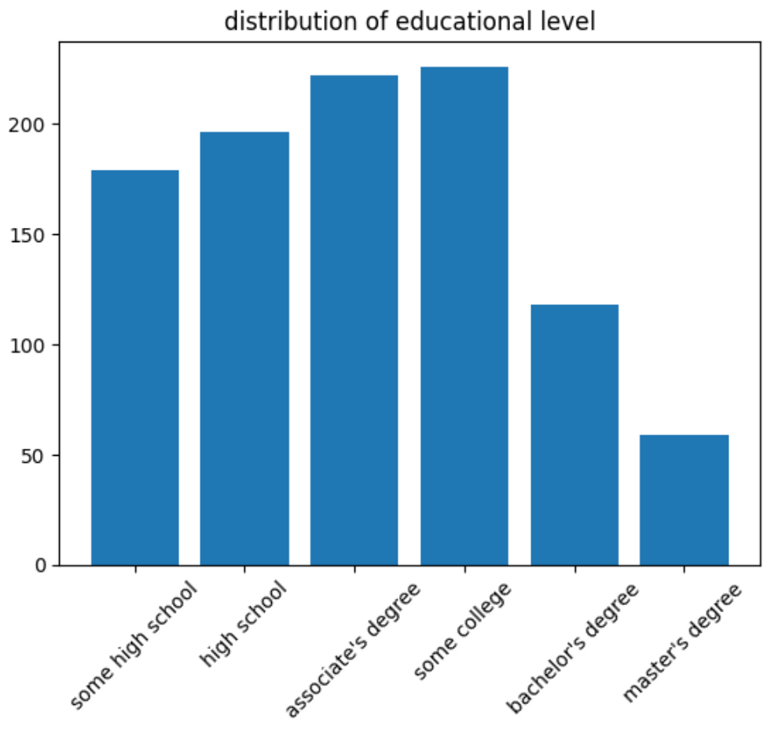
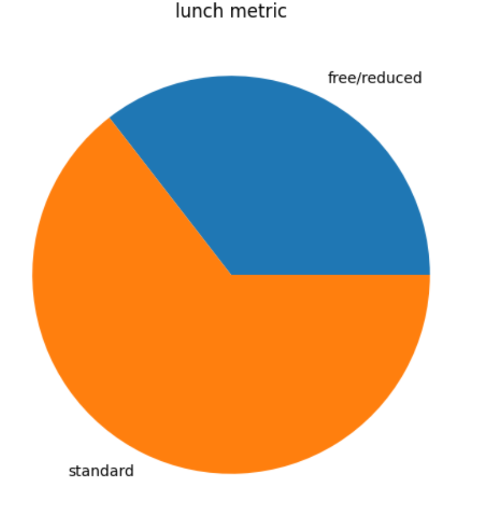
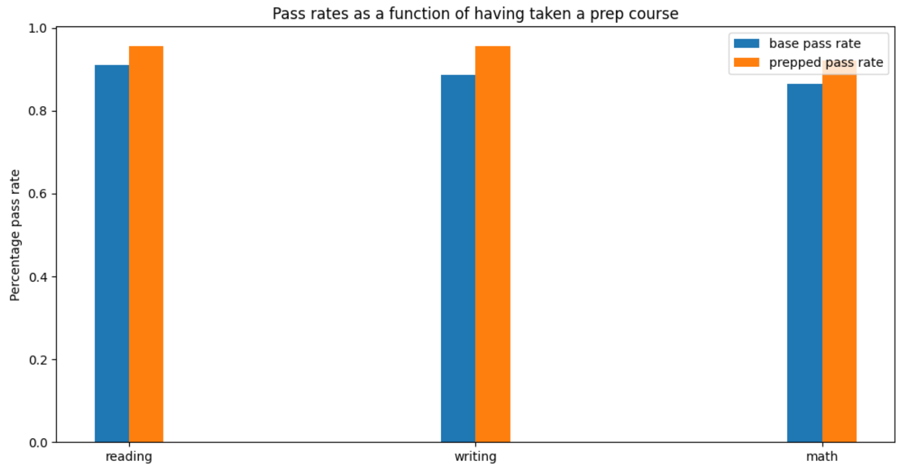
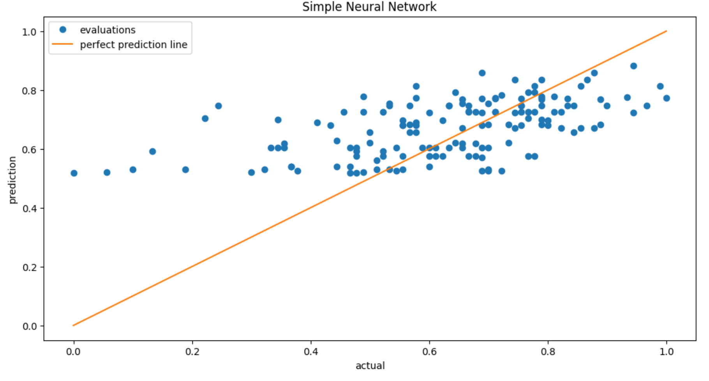

# MeshTask
Take Home task for Mesh interview

## Problem Statement shown from image

Dataset found here: https://www.kaggle.com/datasets/spscientist/students-performance-in-exams

Let's look at the data!

Lunch type is a proxy for wealth

Preparation course should have a notable impact on the scores

The results are not as expected, let's discuss

While some predictive power is evident in the data, it can be seen that a regressor
(using multiple techniques) performs poorly. It is evident that the data is not sufficient
for the regression task, but shows promise for the less demanding classification task.
